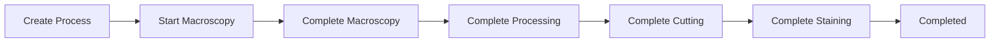

# health_lab_workflow

Módulo de trazabilidad intralaboratorio para GNUHealth 4.4.1

## 🔬 Descripción

Este módulo complementa el módulo `health_lab` de GNUHealth agregando un sistema completo de **trazabilidad de muestras** dentro del laboratorio, cubriendo todo el proceso desde la recepción hasta la entrega de resultados.

## ✨ Características

### 🧪 Sistema de trazabilidad
- **12 tipos de muestra** diferentes
- **7 estados de proceso** claramente definidos
- **Mantiene el número de orden original** durante todo el flujo
- **Registro de institución de origen** con propagación automática

### 🔬 Procesos especializados

#### Biología Molecular
- **PCR** (endpoint, qPCR, RT-PCR)
- **Secuenciación**
- **Extracción de material genético**
- **Electroforesis de proteínas**
- **Control de calidad** (concentración, pureza)

#### Histopatología
- **Histopatología de rutina**
- **Histoquímica**
- **Inmunohistoquímica**
- **FISH** (Fluorescence In Situ Hybridization)
- **Citología**
- **Flujo completo**: macroscopía → procesamiento → inclusión → corte → tinción

#### Inmunoensayo
- **ELISA** (Enzyme-Linked Immunosorbent Assay)
- **CLIA** (Chemiluminescent Immunoassay)
- **Gestión de kits** con lote y fecha de vencimiento
- **Control de calidad**
- **Resultados cuantitativos y cualitativos**

## 📋 Requisitos

- **GNUHealth**: 4.4.1
- **Tryton**: 6.0
- **Python**: 3.8+
- **PostgreSQL**: 12+

### Módulos requeridos
- `health` (módulo principal de GNUHealth)
- `health_lab` (laboratorio básico)

## 🚀 Instalación

### 1. Clonar el repositorio
```bash
cd /usr/local/lib/python3.x/dist-packages/trytond/modules/
git clone https://github.com/tu-usuario/health_lab_workflow.git
```

### 2. Actualizar lista de módulos
```bash
trytond-admin -d <database> --update-modules-list
```

### 3. Instalar el módulo
```bash
trytond-admin -d <database> -i health_lab_workflow
```

### 4. Reiniciar el servidor
```bash
sudo systemctl restart tryton
```

## 📁 Estructura del módulo

```
health_lab_workflow/
├── __init__.py                           # Registro de modelos
├── tryton.cfg                           # Configuración del módulo
├── health_lab_workflow.py               # Modelo principal
├── health_lab_workflow.xml              # Definiciones XML
├── core_imports.py                      # Funciones auxiliares
├── lab_test_request_origin.py           # Extensión Lab Test Request
├── molecular_biology.py                 # Biología molecular
├── molecular_biology_wizard.py          # Wizard biología molecular
├── histopathology.py                    # Histopatología
├── histopathology_wizard.py             # Wizard histopatología
├── immunoassay.py                       # Inmunoensayo
├── immunoassay_wizard.py                # Wizard inmunoensayo
└── view/                                # Vistas XML (17 archivos)
    ├── lab_sample_form.xml
    ├── lab_sample_tree.xml
    ├── create_lab_workflow_start_form.xml
    ├── lab_test_request_form_inherit.xml
    ├── molecular_biology_form.xml
    ├── molecular_biology_tree.xml
    ├── create_molecular_biology_start_form.xml
    ├── histopathology_form.xml
    ├── histopathology_tree.xml
    ├── histopathology_antibody_form.xml
    ├── histopathology_antibody_tree.xml
    ├── create_histopathology_start_form.xml
    ├── immunoassay_form.xml
    ├── immunoassay_tree.xml
    ├── immunoassay_antibody_form.xml
    ├── immunoassay_antibody_tree.xml
    └── create_immunoassay_start_form.xml
```

## 🔄 Uso

### Flujo básico

1. **Crear Lab Test Request** en el módulo health_lab
2. **Create Lab Workflow** desde el formulario Lab Test Request
3. **Recibir muestra** en el laboratorio (`Receive at Lab`)
4. **Crear procesos específicos** según el tipo de análisis
5. **Completar cada proceso** siguiendo su flujo específico
6. **Auto Complete** cuando todos los procesos terminan
7. **Lab: Create Test** para generar el resultado final

### Ejemplo: Proceso de Histopatología



**Caso especial - Citología**: Salta directamente a la etapa de corte

### Ejemplo: Biología Molecular


## 🔧 Configuración

### Institución por defecto

El módulo obtiene automáticamente la institución del usuario actual. Para configurar:

1. Ir a **Health → Health Professionals**
2. **Asignar una institución** al profesional de salud
3. El campo se llenará automáticamente en las solicitudes

### Tipos de muestra

Los tipos de muestra están definidos en `SAMPLE_TYPES`:

- Sangre, orina, deposiciones
- Tejido fijado en formalina
- Molde de parafina
- Frotis exfoliativo y por punción
- Secreciones, esputo, saliva, LCR

## 🛠️ Desarrollo

### Agregar nuevos tipos de muestra

Editar la constante `SAMPLE_TYPES` en `health_lab_workflow.py`:

```python
SAMPLE_TYPES = [
    ('blood', 'Blood'),
    ('urine', 'Urine'),
    ('new_type', 'New Sample Type'),  # Agregar aquí
    # ...
]
```

### Agregar nuevos tipos de estudio

Para cada grupo (molecular, histopatología, inmunoensayo), editar el campo correspondiente:
- `study_type` en `molecular_biology.py` y `histopathology.py`
- `assay_type` en `immunoassay.py`

### Estructura de tests

```python
def test_complete_workflow():
    """Test del flujo completo"""
    # 1. Crear Lab Test Request
    # 2. Create Lab Workflow
    # 3. Receive at Lab
    # 4. Create processes
    # 5. Complete all processes
    # 6. Verify auto-complete
    # 7. Verify Lab: Create Test
```

## 🔍 API Principal

### Modelos principales

```python
# Trazabilidad principal
gnuhealth.lab.workflow.sample

# Procesos especializados  
gnuhealth.lab.molecular_biology
gnuhealth.lab.histopathology
gnuhealth.lab.immunoassay

# Modelos de detalle
gnuhealth.lab.histopathology.antibody
gnuhealth.lab.immunoassay.antibody
```

### Estados del workflow

```python
WORKFLOW_STATES = [
    ('pending', 'Pending Collection'),
    ('collected', 'Collected'),
    ('received', 'Received at Lab'),
    ('processing', 'Processing'),
    ('completed', 'Completed'),
    ('rejected', 'Rejected'),
]
```

## 📊 Características avanzadas

### Auto-completado inteligente
- **Detecta automáticamente** cuando todos los procesos están terminados
- **Habilita el botón** "Auto Complete"
- **Permite continuar** con "Lab: Create Test"

### Trazabilidad completa
- **Número de orden original** se mantiene en todos los procesos
- **Institución de origen** se propaga automáticamente
- **Estados sincronizados** entre workflow y procesos

### Validaciones
- **No permite procesos duplicados** activos
- **Validaciones por etapas** según el tipo de proceso
- **Mensajes de error específicos** para cada caso

## 🤝 Contribuciones

Las contribuciones son bienvenidas. Por favor:

1. **Fork** el proyecto
2. **Crea una rama** para tu característica (`git checkout -b feature/AmazingFeature`)
3. **Commit** tus cambios (`git commit -m 'Add some AmazingFeature'`)
4. **Push** a la rama (`git push origin feature/AmazingFeature`)
5. **Abre un Pull Request**

## 📝 Licencia

Este proyecto está licenciado bajo GPL-3.0+ - ver el archivo [LICENSE](LICENSE) para detalles.

## 👨‍⚕️ Autor

Desarrollado por un patólogo molecular para la comunidad GNUHealth.

## 🆘 Soporte

Para reportar problemas o solicitar características:

- **Issues**: [GitHub Issues](https://github.com/tu-usuario/health_lab_workflow/issues)
- **Documentación**: Ver carpeta `docs/`
- **Email**: [tu-email@ejemplo.com]

## 🎯 Roadmap

### Versión 1.1
- [ ] Dashboard de laboratorio
- [ ] Reportes específicos por tipo
- [ ] Integración con equipos
- [ ] Sistema de alertas

### Versión 1.2
- [ ] Códigos de barras
- [ ] Exportación de datos
- [ ] API REST
- [ ] Métricas avanzadas

---

⭐ **¡Si este módulo te es útil, no olvides darle una estrella!** ⭐